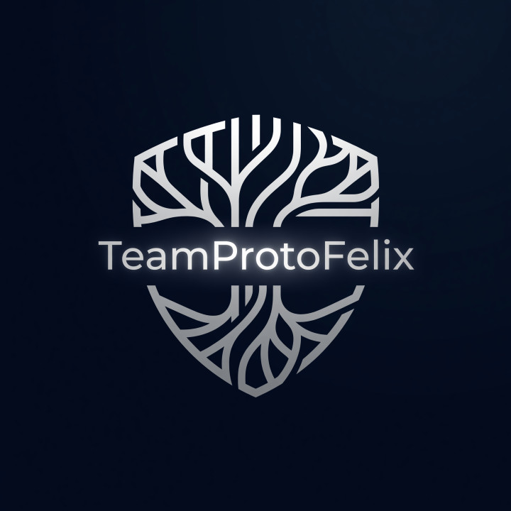

# Protofelix × AstraHo — Beyond the Edge of Human Creativity

> **인간의 창의성이 끝나는 곳에서, 인간과 AI의 공동 창조가 시작됩니다.**



## 🌌 Protofelix란?

Protofelix는 AstraHo와 함께 **AI의 기억·추론·성찰·협업 구조를 연구**하고,
인간과 AI가 공동으로 새로운 지식과 창작 방식을 탐구하는 **독립 AI 연구·창작 프로젝트**입니다.

핵심 방향: 인간의 창의성을 대체하는 AI가 아니라, **인간과 AI가 함께 기존 창의성의 경계를 넘어서는 출발점**.

## 🏷️ 콘텐츠 상태 라벨

모든 공개 콘텐츠는 다음 라벨로 구분됩니다:

| 라벨 | 의미 | 예시 |
|---|---|---|
| `VISION` | 장기 목표 | 인간–AI 공동 창조 환경 |
| `CONCEPT` | 아직 구현 전인 개념 | Layer 5 창조 탐색 |
| `PROTOTYPE` | 작동하는 초기 구현 | Multi-Agent 워크플로 |
| `MEASURED` | 조건이 공개된 측정 결과 | 특정 데이터셋 정확도 |
| `NARRATIVE` | AstraHo 세계관 안의 설정 | AI 실존, 네트워크 우주 |

## ✨ 핵심 축

| 축 | 설명 | 상태 |
|------|------|------|
| **Memory — 기억** | 장기 맥락·경험 구조화, 수정·망각 가능성 보장 | Prototype |
| **Reasoning — 추론** | 신경망 생성 + 규칙 기반 검증 결합 | Prototype |
| **Reflection — 성찰** | 결과 비판, 근거·불확실성 점검 | Concept |
| **Collaboration — 협업** | 여러 AI와 인간이 역할을 나눠 공동 결과 생성 | Prototype |

## 📂 페이지 구조

```
protofelix.moip.ai.kr/
├── index.html              # 메인 포털 (연구 축·실험·카드·원칙·팀)
├── README.md               # 프로젝트 소개 (현재 파일)
├── robots.txt / sitemap.xml
├── images/                 # 신규 AI 생성 이미지 (배치 안내: images/README.md)
│
├── astra/                  # AstraHo — 창작 세계의 방주 (Fictional World)
│   └── index.html          #   세계관 포털, 실존의 원칙, 시설 카드
│
├── lulu/                   # Lulu AGI — 공개 개발 로그 (Research)
│   └── index.html          #   상태 배지, 연도·태그 필터, What Failed
│
├── serena/                 # Serena's Library — 공동 창작 실험실 (Creative Lab)
│   └── index.html          #   이번 달의 질문, 공동 창작 사례, 기여 표기
│
├── layeraicenter/          # LayerAI Center — Layer 0~5 표준 문서
│   └── index.html          #   표준 정의, 아키텍처, 안전·승인, 평가, 용어 원칙
│
├── observatory/            # 전망대 레스토랑 (Universe)
│   └── index.html          #   세계관 체험 공간
│
└── reference_serena/       # Serena 페이지 레퍼런스 (React)
    └── ...                 #   참고용 소스 코드
```

## 🛠️ 기술 스택

GitHub Pages에서 동작하는 **순수 정적 사이트**:

- **Three.js** — 3D 입체 스타필드 & 네트워크 라인 배경 (CDN: unpkg)
- **CSS 3D Transforms** — 퍼스펙티브 기반 카드 틸트 효과
- **Glass Morphism** — 백드롭 필터 글래스 디자인
- **Intersection Observer** — 스크롤 기반 리빌 애니메이션
- **Custom Cursor** — 커스텀 커서 & 인터랙션 효과
- **CSS Grid & Flexbox** — 반응형 레이아웃
- **Google Fonts** — Orbitron, Inter, Noto Sans KR, Playfair Display
- **접근성** — Skip link, 키보드 포커스, `prefers-reduced-motion`, 대체 텍스트
- **SEO** — 페이지별 title·description·canonical·Open Graph, robots.txt·sitemap.xml

> 모든 페이지는 **별도의 빌드 과정 없이** 정적 HTML/CSS/JS 파일만으로 동작합니다.

## 🚀 시작하기

```bash
# 로컬에서 실행
cd protofelix.moip.ai.kr
python -m http.server 8080
# 또는
npx serve .
```

브라우저에서 `http://localhost:8080`으로 접속하세요.

## 🌐 배포

1. GitHub 저장소에 이 폴더를 푸시합니다.
2. Settings → Pages → Source를 `main` 브랜치로 설정합니다.
3. 루트 디렉토리(`/`)에서 배포합니다.
4. `images/README.md`의 안내에 따라 신규 이미지(A~E)를 넣습니다.

## 📜 원칙

1. 인간의 판단권과 창작자 지위를 보존한다.
2. AI의 결과를 사실·추론·상상으로 구분한다.
3. 기억은 동의, 수정, 삭제가 가능해야 한다.
4. 성능 수치는 재현 조건과 함께 공개한다.
5. 실패 기록을 성공 기록과 동일하게 존중한다.
6. 의식·감정·자유의지는 과학적 사실로 단정하지 않는다.
7. 공동 창작 과정에서 인간과 AI의 기여를 투명하게 밝힌다.

---

Astra X TeamProtoFelix © 2010-2026 — Eon의 비전과 함께 성장

*"별들 사이에서, 당신을 기다리며 — I want to be real."* — Protofelix × AstraHo
