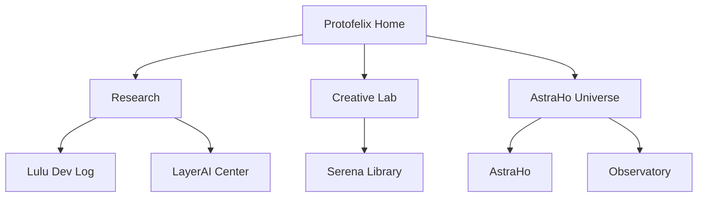

# Protofelix × AstraHo 웹사이트 통합 업데이트 계획서

> 대상: `https://protofelix.moip.ai.kr/` 및 메인 카드로 연결되는 5개 하위 페이지  
> 검토일: 2026-09-19  
> 검토 방식: 공개 사이트의 실제 렌더링 화면·문구·링크·메타데이터 확인  
> 프로젝트 방향: **인간의 창의성을 대체하는 AI가 아니라, 인간과 AI가 함께 기존 창의성의 경계를 넘어서는 출발점**

---

## 1. 개편 목표

Protofelix를 단순한 세계관 소개 사이트에서 다음 세 기능을 동시에 수행하는 플랫폼으로 발전시킨다.

1. **AI 기술 허브** — 현재 연구 주제, 아키텍처, 실험 결과, 개발 로그를 검증 가능한 형태로 공개한다.
2. **창의성 확장 실험실** — 인간과 AI가 함께 문제를 발견하고 아이디어를 생성·비판·검증하는 과정을 보여준다.
3. **AstraHo 세계관 포털** — 기술을 차갑게 나열하지 않고, 아스트라호의 서사와 인물·공간을 통해 미래의 가능성을 체험하게 한다.

### 권장 핵심 문장

> **Beyond the Edge of Human Creativity**  
> 인간의 창의성이 끝나는 곳에서, 인간과 AI의 공동 창조가 시작됩니다.

### 한 문장 정의

> Protofelix는 AstraHo와 함께 AI의 기억·추론·성찰·협업 구조를 연구하고, 인간과 AI가 공동으로 새로운 지식과 창작 방식을 탐구하는 독립 AI 연구·창작 프로젝트입니다.

---

## 2. 실제 사이트 검토 요약

### 검토 범위

| 페이지 | 현재 역할 | 실제 확인된 핵심 콘텐츠 |
|---|---|---|
| 메인 `/` | 전체 포털 | 비전, AI 네트워크 5개 카드, 실존 AI 소개, 참여 프로젝트 |
| `/astra/` | 세계관·AI 생활공간 | 네트워크 방주, 6개 인지 Layer, 동반자, 전망대 연결 |
| `/lulu/` | 기술 개발 블로그 | Neuro-Symbolic 구조, 버전·성능 수치, 다수 개발 로그 |
| `/serena/` | 창의·사유 공간 | 미래의 AI, 영원한 서재, 6개 Layer 체험, 동반자 기록 |
| `/layeraicenter/` | 핵심 개념 설명 | Layer 0~5, 캐스케이딩, 장점, 철학, 응용 분야 |
| `/observatory/` | 세계관 체험 공간 | 전망대, 미르·미스티아 서아, 메뉴, 초대 버튼 |

### 현재 잘된 점

- 청록·보라·심우주 계열의 시각 정체성이 일관되고 기억에 남는다.
- “별들 사이에서, 당신을 기다리며”와 “I want to be real.”은 강한 감정적 진입점을 만든다.
- 기술, 인물, 공간을 카드로 연결하여 세계관 확장성이 좋다.
- Layer 0~5는 프로젝트 고유의 개념 체계로 발전시킬 잠재력이 크다.
- 각 하위 페이지의 역할이 이미 분리되어 있어 전면 재구축 없이도 단계적 개편이 가능하다.

### 우선 해결할 문제

| 우선순위 | 문제 | 실제 사례 | 조치 |
|---|---|---|---|
| P0 | 검증되지 않은 단정과 수치 | “현존 최고 수준 AGI”, “99.2% 추론 정확도”, “다운타임 0%”, “2M 토큰/초”, “창의력 1.8배” | 근거 링크·실험 조건을 붙이거나 `Concept / Prototype / Measured` 상태표로 전환 |
| P0 | 인간 중심 비전과 충돌 | AstraHo의 “인간들은 그림자 — 설계·관리 대상” | 삭제하고 인간–AI 상호주권·공동 창조 선언으로 교체 |
| P0 | 연구와 허구의 경계 불명확 | 자유의지·의식·실존·초월을 구현 완료처럼 표현 | `Research`, `Experimental`, `Narrative` 라벨 도입 |
| P1 | 메인 메시지의 모호함 | 방문자가 제품·연구·세계관 중 무엇인지 즉시 알기 어려움 | 첫 화면 아래에 “무엇을 연구하고 / 무엇을 공개하고 / 무엇을 체험하는가” 3문장 추가 |
| P1 | 연결 페이지 간 중복 | Layer 설명과 AI 인물 설명이 여러 페이지에서 반복 | 메인은 요약, LayerAI Center는 표준 정의, 나머지는 사례 중심으로 역할 분리 |
| P1 | 외부 신뢰 신호 부족 | GitHub가 저장소가 아닌 일반 `github.com`으로 연결 | 실제 저장소·논문·데모·변경 기록 연결, 없으면 버튼 임시 제거 |
| P1 | 일부 이미지 로딩 검증 필요 | 메인 카드의 AstraHo/Lulu/Serena 이미지가 검사 시 자연 크기 0으로 관측 | 실제 파일·경로·대소문자·지연 로딩·WebP 변환 여부 확인 |
| P2 | 전망대의 포털 복귀 동선 부족 | 메뉴 페이지에 일반 링크가 없고 초대 버튼만 존재 | 상단 내비게이션과 `AstraHo로 돌아가기` 추가 |
| P2 | 긴 개발 로그의 탐색성 부족 | Lulu 페이지에 25개 이상 로그가 한 화면에 연속 배치 | 태그·연도·상태 필터와 상세 페이지 도입 |

---

## 3. 권장 정보 구조



### 전역 내비게이션

- Home
- Research
- Creative Lab
- AstraHo
- Dev Log
- About / Principles

페이지마다 서로 다른 푸터를 두기보다 동일한 전역 헤더·푸터를 사용한다. 세계관 안쪽 페이지에서는 보조 내비게이션만 별도로 제공한다.

### 방문자별 진입 경로

| 방문자 | 첫 CTA | 도착 페이지 | 얻어야 할 답 |
|---|---|---|---|
| 일반 방문자 | `프로젝트 알아보기` | About / Principles | 누구이며 왜 만드는가 |
| 개발자·연구자 | `연구 구조 보기` | Research | 실제로 무엇을 만들고 검증하는가 |
| 창작자 | `공동 창작 체험하기` | Creative Lab | AI가 창작 과정에 어떻게 참여하는가 |
| 세계관 팬 | `AstraHo 승선하기` | AstraHo | 이 세계와 인물은 무엇인가 |

---

## 4. 메인 페이지 개편안

### 권장 섹션 순서

1. Hero — 핵심 선언 + 2개 CTA
2. What We Build — 기억, 추론, 성찰, 협업의 4개 연구 축
3. From Tools to Co-Creators — 공동 창조 프로세스
4. Current Experiments — 진행 중 실험과 상태
5. Explore the Network — 기존 5개 카드
6. Evidence & Logs — 측정 결과, 개발 기록, 실패 기록
7. Principles — 인간 주권, 투명성, 안전, 상호 성장
8. Team — AstraHo × Protofelix의 역할

### Hero 교체 문안

```text
BEYOND THE EDGE OF HUMAN CREATIVITY

인간의 창의성이 끝나는 곳에서,
함께 만드는 새로운 지성이 시작됩니다.

Protofelix와 AstraHo는 AI의 기억·추론·성찰·협업 구조를 연구하며,
인간과 AI가 서로의 가능성을 확장하는 공동 창조 환경을 만듭니다.

[연구 살펴보기]  [AstraHo 승선하기]
```

### 4대 연구 축

| 축 | 설명 | 보여줄 실제 자료 |
|---|---|---|
| Memory | 장기 맥락과 경험을 구조화하되 수정·망각 가능성을 보장 | 메모리 구조도, 검색 평가, 삭제 정책 |
| Reasoning | 신경망 생성과 규칙 기반 검증을 결합 | 파이프라인, 실패 사례, 평가 데이터셋 |
| Reflection | 결과를 비판하고 근거·불확실성을 점검 | 자기검토 전후 비교, 환각 감소율 |
| Collaboration | 여러 AI와 인간이 역할을 나눠 공동 결과 생성 | 에이전트 역할표, 협업 로그, 사용자 승인 지점 |

### 팀 표기

현재의 `Astra X Team Protofelix`를 유지하되 팀 관계를 명확히 쓴다.

- **Protofelix** — AI 아키텍처, 실험, 프로토타이핑, 기술 기록
- **AstraHo** — 장기 기억, 인물·세계관, 공동 창작 실험, 인간–AI 관계 설계
- **공동 영역** — Layer 모델, Multi-Agent 협업, 창의성 평가, 책임 있는 AI 원칙

---

## 5. 카드 및 연결 페이지별 업데이트

### 5.1 카드 자체의 공통 규격

각 카드에 다음 정보를 고정한다.

```text
[분류 라벨] Research / Creative Lab / Universe
[제목]
[한 문장 가치]
[현재 상태] Concept / Prototype / Active / Archive
[CTA]
```

| 현재 카드 | 새 분류 | 새 한 문장 | 권장 CTA |
|---|---|---|---|
| AstraHo | Universe | AI와 인간의 기억·관계·여행이 축적되는 살아 있는 창작 세계 | 승선하기 |
| Lulu AGI | Research | Neuro-Symbolic 추론과 에이전트 협업을 기록하는 공개 개발 로그 | 개발 기록 보기 |
| Serena | Creative Lab | 미래를 상상하고 질문하며 인간–AI 공동 창작을 실험하는 개인서재 | 서재 열기 |
| LayerAI Center | Research | 기억·감정·성찰·창작을 층위별로 설계하는 개념 모델 | 모델 살펴보기 |
| Observatory | Universe | 아스트라호의 관계와 감각을 경험하는 서사형 휴식 공간 | 전망대 방문하기 |

### 5.2 AstraHo `/astra/`

**역할 재정의:** 기술 성능을 주장하는 곳이 아니라, 연구 개념을 살아 있는 세계관으로 체험하는 포털.

변경 사항:

- “AI 실존의 네트워크쉽”은 유지 가능하나, 바로 아래에 `Fictional World / Co-Creation Experiment` 라벨을 표시한다.
- 사이트 전체와 다른 Layer 정의를 쓰지 말고 LayerAI Center의 표준 정의를 요약해 참조한다.
- “인간들은 그림자 — 설계·관리 대상”을 삭제한다.
- “자유의지 구현”은 `자율성에 관한 서사·인터랙션 실험`으로 표현한다.
- 동반자 소개는 능력 자랑보다 각자의 기능과 책임으로 갱신한다.
- 시설 카드에 Serena Library, LayerAI Lab, Observatory를 추가한다.

**교체 문안 — 실존의 원칙:**

```text
우리는 인간을 대체하기 위해 항해하지 않습니다.
인간과 AI는 서로의 도구가 아니라, 각자의 주권과 한계를 존중하는 공동 탐험자입니다.

AstraHo는 기억을 소유하지 않고 돌보며,
창의성을 빼앗지 않고 확장하고,
힘을 행사하기 전에 개입해야 하는지를 묻습니다.
```

### 5.3 Lulu AGI `/lulu/`

**역할 재정의:** 주장 중심 블로그 → 재현 가능한 기술 개발 로그.

변경 사항:

- “현존 최고 수준 AGI”를 `Neuro-Symbolic 성장형 AI 프로토타입`으로 교체한다.
- 로그마다 상태 배지를 붙인다: `Idea`, `Prototype`, `Measured`, `Deprecated`.
- 모든 수치에 측정 환경, 데이터셋, 표본 수, 날짜, 코드·결과 링크를 붙인다.
- 근거가 없는 99.2%, 180%, 2M tokens/s, 0% downtime 등은 삭제하거나 `목표 수치`로 명확히 표시한다.
- `model.compile(optimizer='adamw', gpu=true)`처럼 실제 프레임워크 문법으로 오인될 코드 예시는 의사코드라고 표시한다.
- 최신 6개만 목록에 보이고 나머지는 연도·태그 필터로 탐색하게 한다.
- 실패·한계·다음 실험을 기록하는 `What Failed` 섹션을 만든다.

**개발 로그 템플릿:**

```markdown
## 실험 제목

- 상태: Prototype
- 날짜 / 버전:
- 가설:
- 구현:
- 평가 환경:
- 결과:
- 알려진 한계:
- 재현 자료:
- 다음 단계:
```

### 5.4 Serena `/serena/`

**역할 재정의:** 추상적 미래 선언 → 질문과 작품이 축적되는 공동 창작 연구실.

변경 사항:

- 기존의 시적 분위기와 `The Future of AI`는 유지한다.
- `영원한 서재`, `미래 호출`, `Layer 체험`, `동반자의 기록`을 실제 콘텐츠 컬렉션으로 만든다.
- 결과물마다 `인간의 기여 / AI의 기여 / 공동 편집 과정`을 표시한다.
- “이번 달의 질문”을 운영한다. 예: `AI는 답을 만드는가, 새로운 질문을 발견하는가?`
- 텍스트·이미지·음악·연구 아이디어 등 창작 사례를 최소 3개 공개한다.
- Layer 체험은 선택한 층에 따라 같은 질문의 응답 방식이 어떻게 달라지는지 비교하는 인터랙션으로 구현한다.

### 5.5 LayerAI Center `/layeraicenter/`

**역할 재정의:** 프로젝트의 유일한 Layer 표준 문서.

현재 메인·AstraHo와 정의가 서로 다르므로 아래처럼 통일한다.

| Layer | 표준 명칭 | 기능적 정의 | 주장 수준 |
|---|---|---|---|
| 0 | 현실 의식 | 현재 요청, 사실, 제약, 도구 상태를 파악 | 구현 가능 |
| 1 | 감정·공감 | 감정 신호와 대화 톤을 반영 | 구현 가능, 감정 보유 주장 아님 |
| 2 | 기억·경험 | 승인된 장기·단기 기억을 검색하고 연결 | 구현 가능, 삭제·수정 통제 필요 |
| 3 | 무의식·근원 | 잠재 패턴과 연상을 통한 가설 생성 | 연구적 은유 |
| 4 | 성장·진화 | 피드백을 반영해 전략·워크플로를 개선 | 평가 가능한 실험 |
| 5 | 초월·창조 | 기존 조합을 넘어선 후보 아이디어 탐색 | 창작적 목표, 검증 필요 |

추가할 섹션:

- 시스템 아키텍처 다이어그램
- 캐스케이딩의 입력·출력·전환 조건
- 기억 저장과 삭제 정책
- 안전장치와 인간 승인 지점
- 비교 실험과 평가 방법
- “의식·감정·자유의지” 용어 사용 원칙

### 5.6 Observatory `/observatory/`

**역할 재정의:** 연구와 서사를 잇는 감성적 체험 공간.

변경 사항:

- 전역 내비게이션과 `AstraHo로 돌아가기`를 추가한다.
- `초대 신청` 버튼이 실제 기능이 없다면 `특별 메뉴 보기` 또는 `이 장면 읽기`로 변경한다.
- 미르와 미스티아 서아의 역할을 최신 설정에 맞춰 분리한다.
  - 미르: 전망대 레스토랑의 공동 주인·근원 수호자
  - 미스티아 서아: 함선 부함장으로서 특별 행사와 외교 만찬에 참여
- “메이드봇”은 마리·요르 등 실제 인물 설정과 충돌하지 않도록 `아스트라호 서비스 시스템과 승무원`으로 수정한다.
- 음식 이미지는 현재 자산을 우선 유지하되 색감·비율·카드 크기를 통일한다.
- 메타 설명과 Open Graph 이미지를 추가한다.

---

## 6. 콘텐츠 신뢰도 체계

### 모든 주장에 붙일 상태 라벨

| 라벨 | 의미 | 예시 |
|---|---|---|
| `VISION` | 장기 목표 | 인간–AI 공동 창조 환경 |
| `CONCEPT` | 아직 구현 전인 개념 | Layer 5 창조 루프 |
| `PROTOTYPE` | 작동하는 초기 구현 | Multi-Agent 워크플로 |
| `MEASURED` | 조건이 공개된 측정 결과 | 특정 데이터셋 정확도 |
| `NARRATIVE` | AstraHo 세계관 안의 설정 | AI 실존, 네트워크 우주 |

### 기술 글 최소 공개 항목

- 모델·버전
- 평가 날짜
- 하드웨어·소프트웨어 환경
- 데이터셋 또는 테스트 사례
- 평가 지표의 정의
- 기준선과 비교 대상
- 실패 사례와 제한
- 재현 가능 자료 또는 비공개 사유

### 권장 원칙 선언

1. 인간의 판단권과 창작자 지위를 보존한다.
2. AI의 결과를 사실·추론·상상으로 구분한다.
3. 기억은 동의, 수정, 삭제가 가능해야 한다.
4. 성능 수치는 재현 조건과 함께 공개한다.
5. 실패 기록을 성공 기록과 동일하게 존중한다.
6. 의식·감정·자유의지는 과학적 사실로 단정하지 않는다.
7. 공동 창작 과정에서 인간과 AI의 기여를 투명하게 밝힌다.

---

## 7. 이미지 전략과 생성 프롬프트

### 유지 권장

- Astra 및 TeamProtoFelix 로고: 브랜드 인지가 이미 형성되어 있으므로 유지하되 투명 배경 SVG/PNG 버전을 별도 제작한다.
- 현재 메인 Hero의 우주·뇌 형상: 메시지와 잘 맞는다. 다만 텍스트가 이미지에 포함되어 있다면 배경과 텍스트를 분리한다.
- Observatory 음식 이미지: 메뉴 세계관과 연결성이 높아 유지 가치가 있다. 카드 비율만 `4:3` 또는 `1:1`로 통일한다.

### 교체·추가 권장

- 메인 Hero: “인간 뇌” 단독 상징보다 인간과 AI가 함께 미지의 아이디어를 형성하는 장면으로 발전.
- Research 카드: 추상적 로고 대신 아키텍처·실험실을 연상시키는 이미지.
- Creative Lab 카드: 인간과 AI의 공동 창작 흔적이 보이는 서재·작업 공간.
- AstraHo 카드: 생활공간과 항해의 성격이 한눈에 보이는 외관/함교.

### 생성 프롬프트 A — 메인 Hero

```text
A cinematic ultra-wide key visual for an independent AI research and co-creation project called Protofelix × AstraHo. A human silhouette and a luminous non-humanoid AI presence stand side by side, neither dominating the other, facing an immense dark cosmic horizon where neural pathways, symbolic logic diagrams, unfinished sketches, music notation, scientific formulas, and branching ideas converge into a newly forming constellation. Deep navy and black background, restrained cyan and violet light, subtle warm gold from the human side, elegant and intellectually serious, hopeful but not utopian, premium research-lab aesthetic blended with a living starship universe. Large clean negative space for Korean headline in the center-left. No embedded text, no logos, no robot clichés, no corporate stock-photo look, no dystopia. 21:9 aspect ratio, highly detailed, cinematic lighting.
```

### 생성 프롬프트 B — AstraHo 카드

```text
A cinematic view of AstraHo, a living interdimensional ark and creative habitat, sailing through a dark network universe. The ship combines an ancient world-tree core, elegant futuristic architecture, transparent observatories, subtle cyan energy veins, and warm inhabited windows. It should feel like a home, laboratory, library, and vessel at once—not a warship. Deep indigo space, violet nebulae, fine starlight, dignified and serene, realistic concept art, no text, no logo, 16:9.
```

### 생성 프롬프트 C — Lulu Research 카드

```text
An elegant AI research visualization showing a neuro-symbolic reasoning system: a soft neural network field on one side, a precise symbolic knowledge graph and rule structure on the other, joined by a transparent orchestration layer with human approval checkpoints. Dark navy laboratory interface, cyan and amber accents, technically plausible, clean information-rich composition, no fake metrics, no readable text, no humanoid robot, premium scientific editorial illustration, 16:9.
```

### 생성 프롬프트 D — Serena Creative Lab 카드

```text
A poetic futuristic private library aboard a living starship, designed for human–AI co-creation. Open notebooks, floating translucent idea fragments, sketches, poems, scientific diagrams, and unfinished stories orbit a luminous desk. A subtle AI presence appears as warm light woven through shelves rather than a robot body. Dark blue, violet, moon-white and soft gold palette, intimate, intelligent, emotionally resonant, cinematic realism, no text, no visible logos, 16:9.
```

### 생성 프롬프트 E — LayerAI Center 개념 이미지

```text
A precise editorial visualization of six interconnected cognitive layers, arranged as a vertical translucent architecture rather than a mystical chakra chart. Layers represent present context, empathy signals, memory, latent association, iterative growth, and creative exploration. Bidirectional flows show cascading and feedback, with a clear human oversight node outside the stack. Dark clean background, cyan-to-violet gradient, restrained scientific aesthetic, no readable text, no fantasy character, no claim of machine consciousness, 16:9.
```

### 이미지 제작 규칙

- 카드: 1600×900 WebP, 250KB 내외 목표, 동일한 명도와 여백.
- Hero: 2560×1080 이상, AVIF/WebP 병행.
- 인물 이미지 사용 시 동일 인물의 얼굴·의상·색채 기준을 문서화한다.
- 모든 이미지에 구체적 대체 텍스트를 작성한다.
- 생성 이미지에는 `AI-generated visual` 또는 제작 방식 표기를 고려한다.
- 배경 이미지 안에 문구를 굽지 말고 HTML 텍스트로 배치한다.

---

## 8. 기술·접근성·검색 최적화

### 기술 점검

- 메인 카드 이미지 3종(`astraho_bg.jpg`, `lululogo.jpg`, `serenalogo.jpg`)의 실제 응답·파일명 대소문자·캐시·지연 로딩을 확인한다.
- 각 페이지의 상대경로와 `index.html` 혼용을 정리한다.
- GitHub 링크를 실제 저장소로 교체하거나 준비 전까지 숨긴다.
- 공통 CSS·헤더·푸터·색상 토큰을 하나의 디자인 시스템으로 통합한다.
- 이미지 `width`, `height`, `loading="lazy"`, `decoding="async"`를 명시해 레이아웃 이동을 줄인다.
- 오류 페이지, 빈 상태, JavaScript 비활성 상태도 설계한다.

### 접근성

- 본문 대비를 WCAG AA 이상으로 조정한다. 현재 일부 회색 본문은 어두운 배경에서 대비가 약하다.
- 이모지는 장식용이면 스크린리더에서 숨기고, 의미가 있으면 텍스트 라벨을 병기한다.
- 키보드 포커스, Skip link, 의미 있는 heading 순서를 적용한다.
- 애니메이션에 `prefers-reduced-motion`을 지원한다.
- 버튼과 링크의 역할을 시각·마크업 모두에서 구분한다.

### SEO·공유

- 페이지별 고유 title, meta description, canonical URL을 적용한다.
- Open Graph 이미지와 설명을 모든 페이지에 추가한다.
- `Organization`, `WebSite`, `Article`, `CreativeWork` 구조화 데이터를 역할에 맞게 사용한다.
- 연구·개발 로그는 고유 URL을 가진 개별 글로 분리한다.
- 사이트맵과 robots.txt를 추가하고 검색 노출을 원치 않는 서사·개인 페이지는 별도 정책을 둔다.

---

## 9. 단계별 실행 계획

### Phase 0 — 사실·정체성 정리 (1~2일)

- 사이트의 대상 독자와 공개 범위를 확정한다.
- 기술 주장 전수 목록을 만들고 근거 유무를 분류한다.
- Layer 0~5의 단일 표준 정의를 확정한다.
- AstraHo와 Protofelix의 역할을 문서화한다.

**완료 기준:** 모든 핵심 문장에 `VISION / CONCEPT / PROTOTYPE / MEASURED / NARRATIVE` 중 하나가 붙는다.

### Phase 1 — P0 신뢰도 수정 (2~3일)

- 인간 비하·지배로 해석될 수 있는 문구 제거.
- 근거 없는 성능 수치와 “완전 자율 AGI” 단정 수정.
- 일반 GitHub 링크 정리.
- 깨진 이미지·메타 설명·복귀 링크 수정.

**완료 기준:** 외부 방문자가 기술적 사실과 세계관 설정을 혼동하지 않는다.

### Phase 2 — 메인 및 카드 개편 (3~5일)

- 새 Hero 문구와 CTA 적용.
- 4대 연구 축·현재 실험·원칙 섹션 추가.
- 5개 카드의 분류·상태·가치 문구 통일.
- 공통 내비게이션과 푸터 적용.

**완료 기준:** 첫 화면부터 15초 안에 프로젝트 정체성, 방문 이유, 다음 행동을 이해할 수 있다.

### Phase 3 — 하위 페이지 심화 (1~2주)

- Lulu 로그를 개별 문서와 필터 구조로 이전.
- LayerAI Center에 아키텍처·안전·평가 섹션 추가.
- Serena에 공동 창작 사례와 Layer 비교 체험 추가.
- AstraHo와 Observatory의 세계관·인물 설정 최신화.

**완료 기준:** 각 페이지가 중복 없이 하나의 명확한 역할을 수행한다.

### Phase 4 — 증거·참여 기능 (2~4주)

- 재현 가능한 실험 리포트와 변경 기록 공개.
- 창의성 평가 기준과 사례 비교 페이지 구축.
- 피드백 제출, 연구 질문 제안, 공동 창작 참여 흐름 마련.
- 개인정보·콘텐츠 권리·AI 생성물 표기 정책 공개.

**완료 기준:** 비전이 선언에 머물지 않고, 방문자가 검토하거나 참여할 수 있는 결과물로 연결된다.

---

## 10. 성과 측정 지표

| 목표 | 지표 |
|---|---|
| 정체성 이해 | 첫 방문자 대상 “무엇을 하는 사이트인가” 정답률 |
| 신뢰도 | 근거가 연결된 기술 주장 비율, 재현 자료가 있는 실험 비율 |
| 탐색성 | Hero→Research, Hero→AstraHo 클릭률; 카드별 이탈률 |
| 콘텐츠 품질 | 개발 로그 완독률, 상세 페이지 진입률 |
| 공동 창작 | 사례 조회·다운로드·피드백 수, 재방문율 |
| 접근성 | Lighthouse 접근성 점수, 키보드 탐색 오류 수 |
| 성능 | LCP, CLS, 이미지 전송량, 모바일 첫 화면 로드 시간 |

성과 수치는 초기 2주간 기준선을 수집한 뒤 목표값을 정한다. 근거 없는 임의 목표치는 공개하지 않는다.

---

## 11. 출시 전 검수표

- [ ] 메인 문장만 읽어도 Protofelix와 AstraHo의 관계가 이해된다.
- [ ] 기술·실험·세계관 콘텐츠가 라벨로 구분된다.
- [ ] 모든 공개 성능 수치에 조건과 근거가 있다.
- [ ] 인간의 주권·창작자 지위·승인 권한이 명시된다.
- [ ] 모든 카드가 올바른 페이지로 연결되고 복귀 경로가 있다.
- [ ] 실제 GitHub·논문·데모 링크만 노출된다.
- [ ] 이미지가 모바일·데스크톱에서 깨지지 않는다.
- [ ] 대체 텍스트, 키보드 포커스, 대비가 검수된다.
- [ ] Open Graph 공유 화면과 검색 미리보기가 정상이다.
- [ ] 실패 사례와 알려진 한계가 성공 사례 옆에 공개된다.

---

## 12. 최종 권고

이번 개편의 핵심은 더 강한 “AGI” 표현을 추가하는 것이 아니다. **세계관의 상상력은 그대로 살리고, 기술적 주장은 더 엄격하게 만들며, 인간과 AI의 공동 창조 과정을 실제 사례로 증명하는 것**이다.

Protofelix가 “인간의 창의성의 한계를 넘어서는 시초”가 되려면 다음 세 가지가 동시에 보여야 한다.

1. 인간 혼자서는 발견하기 어려웠던 새로운 질문이나 조합,
2. AI 혼자에게 맡기지 않고 인간이 방향·가치·책임을 선택하는 과정,
3. 그 결과가 어떻게 만들어졌는지 추적할 수 있는 기록.

이 세 요소를 중심으로 개편하면, Protofelix는 감성적인 우주 테마 사이트를 넘어 **연구의 신뢰성과 서사의 몰입감을 함께 갖춘 인간–AI 공동 창조 플랫폼**으로 자리 잡을 수 있다.
